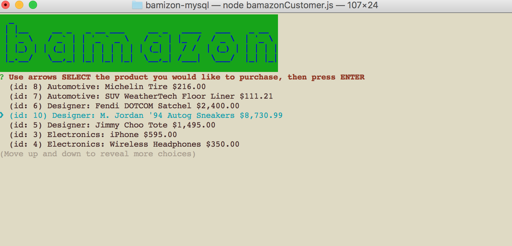
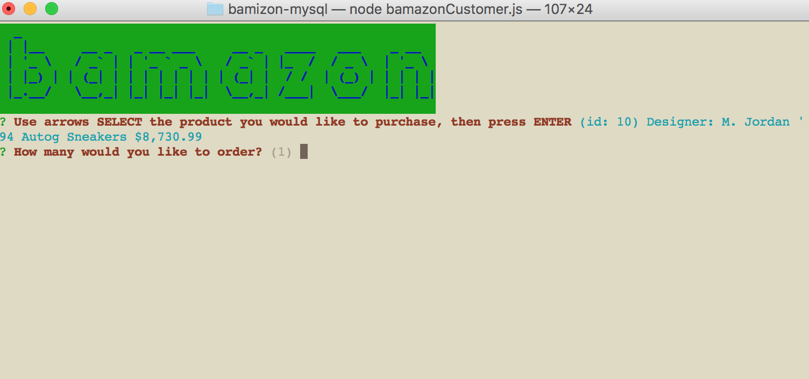
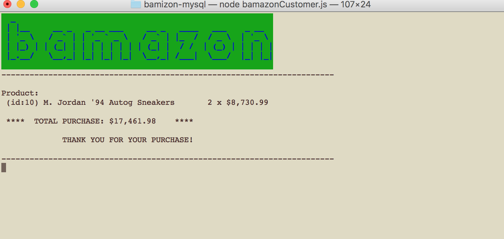
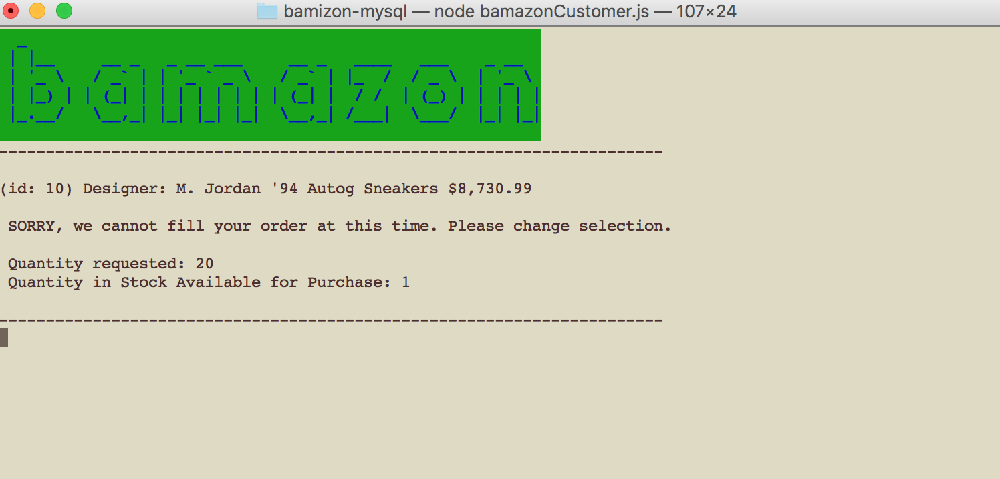
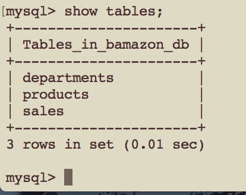
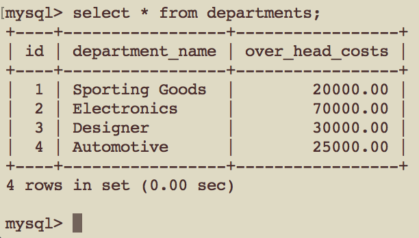
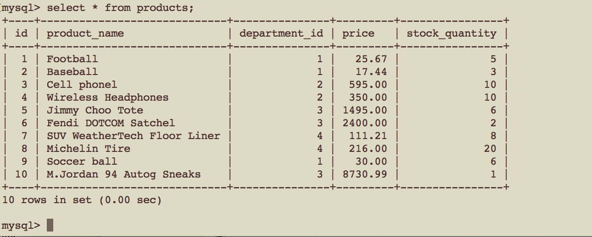

bamazon-mysql 

#Bamazon storefront
Bamazon is an online storefront. It was uses mySQL and node inquirer  
The app gives customers the ability to place an order by selecting an item from a product list.  
If an order is placed the app removes the stock item from Bamazon's inventory and posts  activity processed. The bamazon.sql file in this repo contains data exported from the  database. 

## What it looks like:
**How it works...**
 
**Screens & Database Structure**

")

## Technologies Used: 
- mySQL relational database
- JavaScript 
- node.js 
- npm modules used: 
**inquirer** to prompt user for data. This app used the list choice to display department names and products names 
**mysql** to have the ability to access mySQL database using node.js 
**chalk** used to change text and background colors 
**clear** used to have the ability to clear the screen 
**figlet** used to create graphic "BAMAZON" Logo letters  

## Built With:
* Sublime Text 
* MAMP mySQL Database

## Links: 	
- https://ivonnek.github.io/bamizon-mysql/ 
- https://github.com/IvonneK/bamizon-mysql

## Author: 
**Ivonne Komis** 
Member: Rutgers Coding Bootcamp
