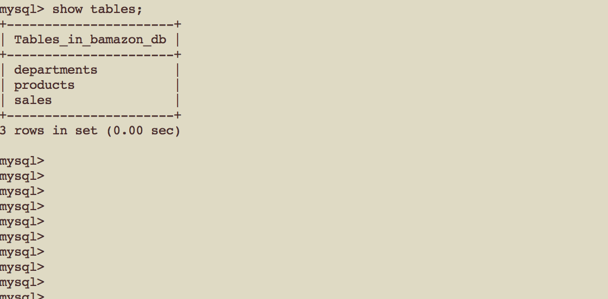
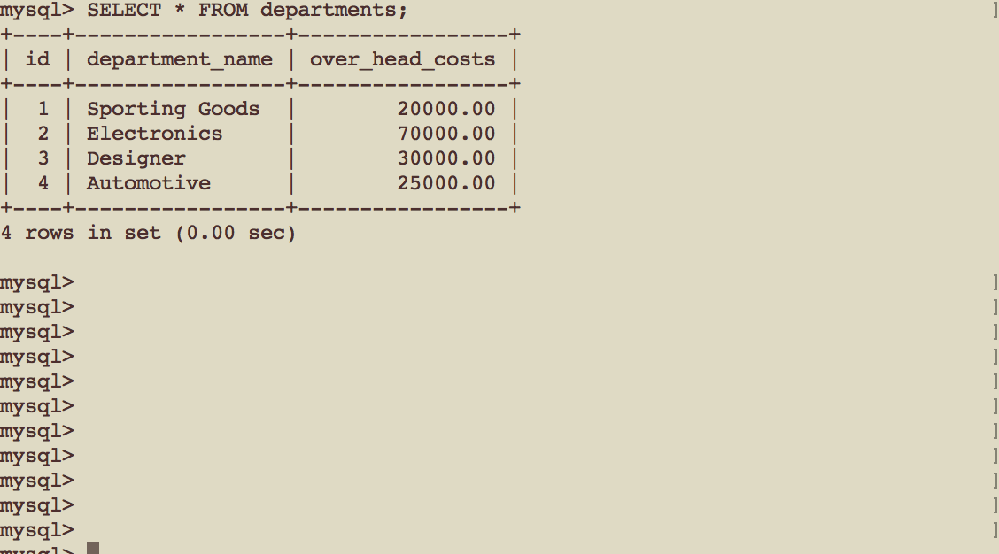

bamizon-mysql 

#Bamizon storefront
Bamizon is similar to the Amazon storefront. Bamizon uses mySQL and node.js.  
The app takes orders from customers using npm inquirer. The items ordered depletes the stock from Bamizon's inventory. 
The bamazon.sql file in this repo contains data exported from the database. 

## What it looks like:
![alt text] (http://g.recordit.co/LA3ZZoOs2d.gif "How it works..."

## Technologies Used: 
- mySQL relational database
- JavaScript 
- node.js 
- npm modules used: 
**inquirer** to prompt user for data (used type: list and type: list choices to display list of products with department names 
**mysql** to have the ability to access mySQL database using node.js  

## Built With:
* Sublime Text 
* MAMP mySQL DB

## Links: 	
- https://ivonnek.github.io/bamizon-mysql/ 
- https://github.com/IvonneK/bamizon-mysql

## Author: 
**Ivonne Komis** 
Member: Rutgers Coding Bootcamp
